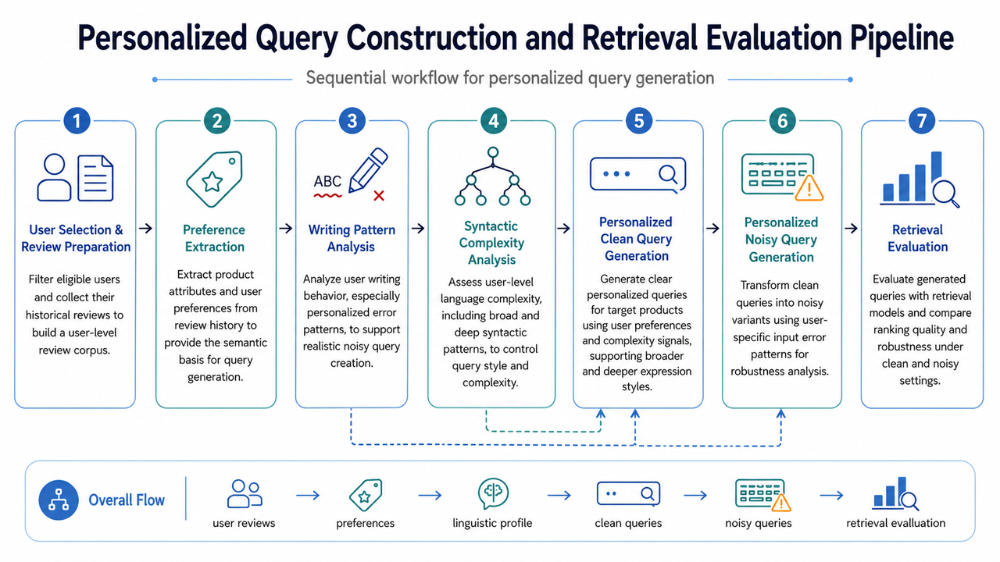

# PersonalQuery

PersonalQuery is a personalized product-search pipeline built from user review history. The project focuses on turning raw review behavior into user-grounded search queries, modeling user-specific writing patterns, and evaluating how personalized and noisy queries affect downstream retrieval.

## Pipeline Overview

The pipeline is organized as a sequential personalized-query construction workflow.



**User filtering and review preparation**

The pipeline first selects qualified users and collects their review history. This stage prepares the user-level review corpus that will be used in all later steps.

**Preference extraction**

The system extracts product attributes and user preferences from historical reviews. These preferences provide the semantic grounding for later query generation.

**Writing-pattern analysis**

The system analyzes user writing behavior, especially user-specific error patterns. These signals are later used to create realistic noisy query variants instead of generic synthetic noise.

**Syntactic complexity analysis**

The pipeline estimates user-level linguistic complexity, including broad and deeper syntactic patterns. These complexity signals are used to control the style and complexity level of generated queries.

**Personalized query generation**

Given user preferences and complexity signals, the system generates personalized queries for target products. Each product can produce different query styles, including broader and deeper formulations.

**Personalized noisy-query generation**

These personalized queries are transformed into noisy queries using user-specific writing-error patterns. This stage creates error-aware query variants for robustness analysis.

**Retrieval evaluation**

The generated queries are evaluated with retrieval models to measure ranking quality and robustness. This stage supports comparison between personalized queries and their noisy variants under the same product-search setting.

Overall, the pipeline maps:

`user reviews -> preferences -> linguistic profile -> personalized queries -> noisy queries -> retrieval evaluation`

## Dataset Overview

The current released dataset is a clustered user-product query dataset with noisy query variants.

### Included Categories

- `Baby_Products`
- `Grocery_and_Gourmet_Food`
- `Pet_Supplies`

### Dataset Files

Three JSON files, one per category:

- `Baby_Products_query.json`
- `Grocery_and_Gourmet_Food_query.json`
- `Pet_Supplies_query.json`

Each file is a JSON array of grouped records, where each grouped record corresponds to one user-product pair. A grouped record contains one query entry per cluster that the pair appears in.

### What Each Record Contains

Each grouped record has a fixed envelope:

- `category`: product domain
- `uuid`: user identifier
- `asin`: target product identifier
- `queries`: list of query entries (see below)

Each query entry has a variable shape:

- `cluster`: integer query-cluster index
- `correct_query`: the correct personalized query

If a writing error was injected for this entry, two additional fields are present:

- `noisy_query`: the noisy query variant (always non-empty when present)
- `error_pattern`: the writing error injected into the query (object with `correct_word` and `error_word` fields)
  - `correct_word`: the correct word from `correct_query` that was replaced
  - `error_word`: the error word that replaced it in `noisy_query`

When no error was injected, the entry has only `cluster` and `correct_query`; the `noisy_query` and `error_pattern` fields are omitted. This is the dominant case: most user-product pairs in the dataset do not have a personalized noise variant.

### Dataset Statistics

| Category | Total | With Noise | Without Noise |
|----------|-------|------------|---------------|
| Baby_Products | 6,535 | 540 | 5,995 |
| Grocery_and_Gourmet_Food | 6,141 | 536 | 5,605 |
| Pet_Supplies | 13,933 | 1,166 | 12,767 |
| **Total** | **26,609** | **2,242** | **24,367** |

### Example Record (with noise injection)

```json
{
  "category": "Baby_Products",
  "uuid": "AE27EZJGURITRHDXGP6RODDKD7PA",
  "asin": "B0891R8DT2",
  "queries": [
    {
      "cluster": 0,
      "correct_query": "I am looking for a Small Food Storage unit that is produced by PandaEar and costs 19.98 for Storage.",
      "noisy_query": "I am laying for a Small Food Storage unit that is produced by PandaEar and costs 19.98 for Storage.",
      "error_pattern": {
        "correct_word": "looking",
        "error_word": "laying"
      }
    }
  ]
}
```

In this example, the word "looking" in the personalized query was replaced with "laying" to create a realistic noisy query variant. This writing error was detected from the user's historical writing patterns in the writing-pattern analysis stage.

## Reproducibility Audit

Every quantitative claim in the companion paper has been audited against the open-source release pipeline with both **file-existence** and **value-validation** checks. The audit catches silent flip of:
- output paths between release and paper,
- numerical values that drift from paper claims,
- infrastructure claims without enumerated outputs.

### Current Audit State (frozen 2026-07-21)

| Status | Count | Meaning |
|--------|-------|---------|
| `verified_value_match` | 0 | file exists, values match paper |
| `verified` | 6 | file exists, no numerical claim |
| `discrepant` | 4 | file exists, values disagree with paper (11.6–78.4% relative delta) |
| `degenerate` | 1 | file exists, selector returned no non-NaN values |
| `partial` | 1 | code referenced, no specific outputs enumerated |
| `unverified` | 5 | code referenced but no expected outputs produced (Stage 12 lineage gap) |
| **Total** | **17** | |

For the full per-claim audit (extracted values, expected values, absolute/relative deltas), see:
- `result/personal_query/iterations/paper_claims_audit.json` (machine-readable; iter #113 adds `generated_at` ISO 8601 timestamp)
- `result/personal_query/iterations/paper_audit_id_mapping.json` (machine-readable paper ↔ audit claim ID index; iter #124 — for each audit ID, list every paper line that cites it; flags `unmapped_audit_ids` and `unmapped_paper_ids`)
- `result/personal_query/iterations/paper_claims_audit_dashboard.html` (self-contained HTML; features):
  - 7 color-coded status badges in summary header (iter #108)
  - rel_delta displayed as percent (e.g. `11.56%`), not raw fraction (iter #109)
  - per-claim value_check panel with severity color (value_match=green / value_mismatch=orange / degenerate=red, iter #110)
  - provenance panels per claim listing `expected_outputs` globs and `code_evidence` script:function references (iter #112)
  - matched_files list for degenerate claims (so reviewer sees exactly which files the selector tried; iter #115)
  - HTML anchors per claim (`#claim-{id}`) + collapsible claims-index sidebar (iter #116) — enables deep-linking from paper footnotes
  - per-section breakdown table (8 sections × 7 status cells) so reviewer can spot which paper section is flakiest (iter #117)
  - inline status legend (iter #118) — 7 statuses each with color dot + label + one-line description
  - generated_at timestamp in header (iter #113)
  - audit_target + claim_id_filter rows (iter #104)
  - `<title>` + `<meta name='description'>` embed summary counts + ISO 8601 generated_at (iter #122) — so browser tab / bookmark / link-preview shows concrete audit state
  - "Sort by severity" toggle button (iter #133) — client-side JS reorders claims by `abs_delta` desc, complementing `--top N` CLI flag for shell triage
  - "Filter by status" click handler on status_summary_table rows (iter #136) — click any of the 7 status rows to filter the claims table to only that status; "Clear filter" button appears when filter active
  - Severity-tier panel (iter #153) — HIGH/MEDIUM/LOW bucketing (HIGH = discrepant rel>20%) with anchor links to claim detail rows; mirror of `--severity-tier` CLI flag (iter #150)
  - Evidence-coverage panel (iter #154) — 4-bucket expected_outputs × code_evidence breakdown with anchor links; mirror of `--evidence-coverage` CLI flag (iter #152)
  - Audit-stats panel (iter #156) — max/mean/min abs_delta + rel_delta_pct + per-status vc count table with mean/max abs; 8th panel color (#e8f5e9 light green); mirror of `--audit-stats` CLI flag (iter #155)

### Re-run the audit

```bash
# Full audit + regression smoke test + dashboard regeneration (~2s)
bash PersoanlQuery/_run_audit_ci.sh

# Ad-hoc inspection of a single claim
python3 PersoanlQuery/paper_claims_audit.py --claim-id RQ3_Fleiss_Kappa_0.72 --verbose

# Strict mode — exit 1 if any non-verified claim detected
python3 PersoanlQuery/paper_claims_audit.py --strict --json-only

# Diff current audit against a frozen baseline JSON — exit 1 if any per-claim flip (status change, value extracted drift, new/removed claim); iter #114
python3 PersoanlQuery/paper_claims_audit.py --diff result/personal_query/iterations/paper_claims_audit.json --json-only

# Print compact 1-line audit summary from the most recent audit JSON without re-running; iter #131
python3 PersoanlQuery/paper_claims_audit.py --status-summary

# Print top N discrepant claims sorted by abs_delta desc from the most recent audit JSON without re-running; iter #133
python3 PersoanlQuery/paper_claims_audit.py --top 3

# Print paper section × audit status count matrix from the most recent audit JSON without re-running; iter #134
python3 PersoanlQuery/paper_claims_audit.py --by-section

# Print relative age of the most recent audit JSON (exit 0 if <= 24h, exit 1 if stale); iter #135
python3 PersoanlQuery/paper_claims_audit.py --audit-age

# Print claims as markdown table (sorted by severity) for pasting into GitHub PR comments / Slack; iter #137
python3 PersoanlQuery/paper_claims_audit.py --md-table | pbcopy

# List just the 'degenerate' claims with id, section, and matched_files for diagnosis; iter #138
python3 PersoanlQuery/paper_claims_audit.py --list-degenerate

# List just the 'unverified' claims with id, section, and code_evidence for iter #87 planning; iter #139
python3 PersoanlQuery/paper_claims_audit.py --list-unverified

# List just the 'partial' claims with id, section, and expected_outputs for audit-scope diagnosis; iter #140
python3 PersoanlQuery/paper_claims_audit.py --list-partial

# Print claims as RFC-4180 CSV (8 cols) sorted by severity for spreadsheet import (Excel / Sheets); iter #141
python3 PersoanlQuery/paper_claims_audit.py --csv > audit.csv

# List just the 'verified' claims (evidence-backed set) with id, section, expected_outputs; iter #142
python3 PersoanlQuery/paper_claims_audit.py --list-verified

# List just the 'discrepant' claims (audit-mismatch) with id, section, max abs_delta, rel_delta_pct; iter #143
python3 PersoanlQuery/paper_claims_audit.py --list-discrepant

# Group audit claims by source directory (Stage) with per-status breakdown (coverage-gap view); iter #144
python3 PersoanlQuery/paper_claims_audit.py --count-by-codebase-dir

# Show worst-claim-per-paper-section (max abs_delta per section) sorted desc — paper erratum triage; iter #145
python3 PersoanlQuery/paper_claims_audit.py --worst-by-section

# Substring search across id / section / reason / expected_outputs / code_evidence (case-insensitive); iter #146
python3 PersoanlQuery/paper_claims_audit.py --find-claim GMM

# 2D matrix source dir (rows) × audit status (columns) with counts + footer TOTAL; iter #147
python3 PersoanlQuery/paper_claims_audit.py --summary-by-source-dir-and-status

# 2D matrix paper section (rows) × audit status (columns) with counts + footer TOTAL; iter #148
python3 PersoanlQuery/paper_claims_audit.py --summary-by-section-and-status

# Worst-claim-per-source-dir sorted desc — code-side erratum triage (counterpart to --worst-by-section); iter #149
python3 PersoanlQuery/paper_claims_audit.py --worst-by-source-dir

# HIGH/MEDIUM/LOW severity-tier bucketing (HIGH = discrepant rel>20%); executive triage view; iter #150
python3 PersoanlQuery/paper_claims_audit.py --severity-tier

# List claims with id starting with PREFIX (case-insensitive); prefix-anchored complement to --find-claim; iter #151
python3 PersoanlQuery/paper_claims_audit.py --claim-by-id-prefix Sec2

# Evidence coverage (expected_outputs × code_evidence buckets); audit-scope expansion planning; iter #152
python3 PersoanlQuery/paper_claims_audit.py --evidence-coverage

# Aggregate numeric statistics (max/mean abs_delta + max/mean rel_delta_pct + per-status vc counts); iter #155
python3 PersoanlQuery/paper_claims_audit.py --audit-stats

# Per-paper-section numeric statistics (extends iter #155 from global to per-section); iter #157
python3 PersoanlQuery/paper_claims_audit.py --stats-by-section

# Per-source-dir numeric statistics (mirror iter #157 for source-dir axis, uses iter #149 _primary_dir); iter #158
python3 PersoanlQuery/paper_claims_audit.py --stats-by-source-dir
```

### Pre-commit hook (optional, one-time setup)

```bash
bash PersoanlQuery/install_audit_precommit.sh
```

This installs `.git/hooks/pre-commit` → `PersoanlQuery/_run_audit_ci.sh`. After installation, every `git commit` automatically re-runs the audit and blocks the commit if any silent flip is detected. Bypass once with `git commit --no-verify`; uninstall with `rm .git/hooks/pre-commit`. See `PersoanlQuery/_AUDIT_CI_README.md` for details.

### Re-execution cost (to flip non-verified → verified)

| Backlog iter | Stage | Estimated time | Flips |
|--------------|-------|----------------|-------|
| iter #87 | Stage 12 + Stage 10 latent representations | 9–21 h GPU (SLURM) | 5 unverified → verified |
| iter #88 | Stage 6/9 query pool rebuild | 1.5–3 h GPU | 1 degenerate → verified |

After either re-run, update `PersoanlQuery/_smoke_audit_regression.py` with the new expected values and re-commit the regenerated `paper_claims_audit.json` together.

### Paper ↔ audit cross-references (iter #119, #123)

The companion paper's Table 1, 2, and 3 inline footnotes each name the corresponding audit claim IDs in backticks (e.g. `RQ3_Fleiss_Kappa_0.72`, `RQ4_GMM_Best_Prior`). The §1 reproducibility-audit paragraph enumerates all six §2.2 infrastructure claim IDs (iter #123). Reviewer can:
- **paper → audit JSON**: `grep RQ3_Fleiss_Kappa_0.72 result/personal_query/iterations/paper_claims_audit.json`
- **paper → dashboard**: open `result/personal_query/iterations/paper_claims_audit_dashboard.html#claim-RQ3_Fleiss_Kappa_0.72` (browser native anchor)
- **audit → paper**: each dashboard claim row shows its paper section (e.g. `§3.3 + Table 2`)

This forms a closed 4-way loop: paper ↔ audit JSON ↔ dashboard anchors ↔ `--diff` CLI. All 17 audit IDs are covered either by inline Table 1/2/3 footnote backticks or by the §1 paragraph; regression test Case I (iter #123) freezes this coverage.
