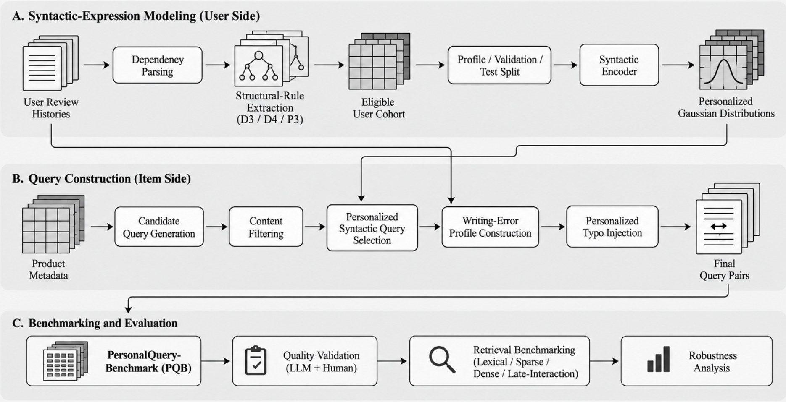

# PersonalQuery

PersonalQuery is a personalized product-search pipeline built from user review history. The project focuses on turning raw review behavior into user-grounded search queries, modeling user-specific writing patterns, and evaluating how personalized and noisy queries affect downstream retrieval.

This document describes the conceptual architecture of the pipeline and the structure of its released dataset. Operational details (code, scripts, configuration, run instructions) live in their respective subdirectories; this README is intentionally free of execution references.

## Pipeline Architecture

The pipeline is organized as a sequential personalized-query construction workflow. Each stage transforms a representation into a richer one, and the full chain maps raw user history into retrieval-ready queries and their noisy variants.



The seven conceptual stages are:

**User filtering and review preparation**

The pipeline first selects qualified users and collects their review history. This stage prepares the user-level review corpus that will be used in all later steps.

**Preference extraction**

The system extracts product attributes and user preferences from historical reviews. These preferences provide the semantic grounding for later query generation.

**Writing-pattern analysis**

The system analyzes user writing behavior, especially user-specific error patterns. These signals are later used to create realistic noisy query variants instead of generic synthetic noise.

**Syntactic complexity analysis**

The pipeline estimates user-level linguistic complexity, including broad and deeper syntactic patterns. These complexity signals are used to control the style and complexity level of generated queries.

**Personalized query generation**

Given user preferences and complexity signals, the system generates personalized queries for target products. Each product can produce different query styles, including broader and deeper formulations.

**Personalized noisy-query generation**

These personalized queries are transformed into noisy queries using user-specific writing-error patterns. This stage creates error-aware query variants for robustness analysis.

**Retrieval evaluation**

The generated queries are evaluated with retrieval models to measure ranking quality and robustness. This stage supports comparison between personalized queries and their noisy variants under the same product-search setting.

Overall, the pipeline maps:

`user reviews -> preferences -> linguistic profile -> personalized queries -> noisy queries -> retrieval evaluation`

## Dataset Architecture

The released dataset groups users by target product and pairs each user with a clean personalized query and a noisy personalized variant derived from the user's own writing-error profile. The dataset is structured around three product categories and exposes a fixed per-record schema that consumers can rely on regardless of which category they target.

### Categories

The dataset covers three product domains:

- `Baby_Products`
- `Musical_Instruments`
- `Video_Games`

Each category has one corresponding dataset file in the release. Consumers index into the file by category name; downstream processing is otherwise identical across categories.

### File Layout

Each dataset file is a JSON object keyed by ASIN (the target product identifier). The value at each key is a list of all users who contributed a personalized query for that product.

```
<ASIN>: [
  { <user record 1> },
  { <user record 2> },
  ...
]
```

### Record Schema

Every user record inside an ASIN's list has a fixed four-field shape:

- `asin`: target product identifier (mirrors the surrounding key)
- `uid`: user identifier
- `syntax_query`: the clean personalized query generated for this user–product pair
- `typo_query`: the noisy variant of `syntax_query`, produced by injecting writing errors sampled from this user's writing-error profile

The clean and noisy queries are always paired, so consumers can treat them as a within-record comparison unit for robustness evaluation. There is no per-record error annotation beyond the visible `typo_query` text; the underlying error pattern is recoverable by diffing the two strings if needed.

### Dataset Statistics

| Category | ASINs | User–Product Pairs |
|----------|-------|--------------------|
| Baby_Products | 1,428 | 2,714 |
| Musical_Instruments | 1,603 | 3,052 |
| Video_Games | 1,661 | 3,084 |
| **Total** | **4,692** | **8,850** |

### Example Record

```json
{
  "B0891R8DT2": [
    {
      "asin": "B0891R8DT2",
      "uid": "AE27EZJGURITRHDXGP6RODDKD7PA",
      "syntax_query": "I am looking for a Small Food Storage unit that is produced by PandaEar and costs 19.98 for Storage.",
      "typo_query": "I am laying for a Small Food Storage unit that is produced by PandaEar and costs 19.98 for Storage."
    }
  ]
}
```

In this example, the word "looking" in the clean query was replaced with "laying" to create the noisy variant. This writing error was detected from the user's historical writing patterns in the writing-pattern analysis stage.

## Documentation Layout

The repository's top-level documentation is organized as:

- `README.md` (this file) — conceptual architecture and dataset schema
- `pipeline.png` — end-to-end pipeline diagram
- Subdirectory READMEs — per-stage architectural notes (where applicable)

Consumers of the dataset and readers of the paper should treat this file as the canonical entry point. Code-level and run-level documentation live next to their implementation rather than being duplicated here.